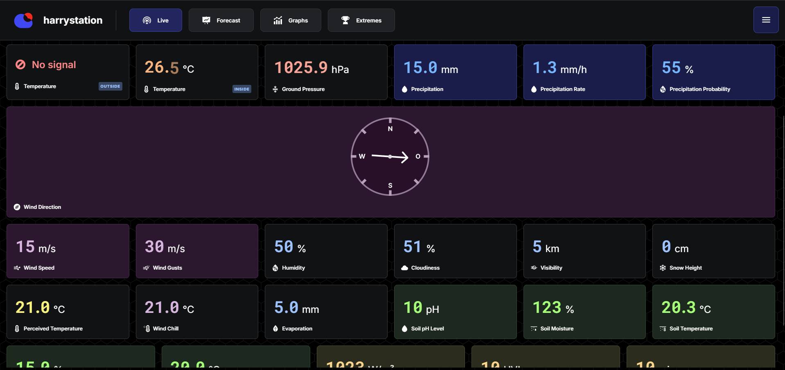

# Create your own weather control center, for free!

**open weather vision** (_owvision_ in short) is a _software system_ that allows you to

-   record
-   archive
-   analyze

and

-   share

the weather data of your _personal weather station(s)_. It is a self-hostable, open source solution. You only need a Raspberry Pi visible in your network (or in the whole world😉) to get started!

**[To get started read the official documentation!](https://open-weather-vision.github.io/owvision/)**

## About this repository

This repository is a mono repository holding the different building blocks of owvision.

### ⚙️📊 The central processing unit - The "demon"

The [**demon**](./demon/README.md) is responsible for processing and managing each weather station's data inside a database. It is also responsible for providing a convenient, secured interface in form of a RESTful API and websockets. It is written in [Go](https://go.dev/).

### 🔴📹 A flexible input buffer - The "recorder"

The [**recorder**](./recorder/README.md) is responsible for connecting to a weather station via an interface and sending buffered weather station data to the demon via [MQTT](https://mqtt.org/). The demon is also written in [Go](https://go.dev/). It is flexible, lightweight and robust, e.g. is able to deal with connection issues of many kinds and can run on lowpower devices like an Raspberry Pi.

### 📊🪄 An easy to user graphical user interface - The "dashboard"

The [**dashboard**](./dashboard/README.md) is the entry point for most users. Live and historic weather data is **visualized** in a modern, intuitive way by default✨. There is support for themes, light☀️ and dark mode🌙. Communicates with the "demon" in the background.

It also comes with an admin panel, that allows you to manage your weather station's and their data🛠️.

### 🤓👾 A concise and easy to use cli - In short "owvi"

[**owvi**](./owvi/README.md) allows you to manage your weather station and analyze live data via a command line interface. Developer friendly🤓. Communicates with the "demon" in the background.
